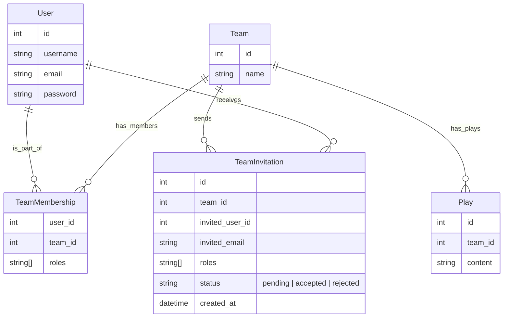

# football-website
# Informieren

# Planen
## Arbeitsplan
| Arbeitspaket                           | Aufwand     | Status |
| -------------------------------------- | ----------- | ------ |
| Informieren                            | 2 std       |    - [x]   |
| User Stories                           | 2 std       |      - [x]  |
| Backend Plan                           | 6 std       |       -[x] |
| Frontend Plan                          | 6 std       |       -[x] |
| Vervollständigung User Impl backend    | 3 std       |       -[ ] |
| Team Impl backend                      | 4 std       |       -[ ] |
| Play Impl backend                      | 4 std       |        -[ ]|
| Dashboard Impl Frontend                | 6 std       |        -[ ]|
| Login / logout erweiterung falls nötig | 6 std       |       -[ ] |
| plays impl frontend                    | 6 std       |       -[ ] |
| members impl frontend                  | 6 std       |       -[ ] |
| Frontend Design                        | 6 std       |       -[ ] |
| Optionale erweiterungen (OPTIONAl      | Undefiniert |       -[ ] |
## User Story 1 Registration
**Als** Benutzer  
**möchte ich** mich registrieren und Rollen wie Coach oder Spieler annehmen können  
**damit** ich Teams erstellen oder ihnen beitreten kann, abhängig von meiner Rolle in jedem Team.

### Akzeptanzkriterien
- Der Benutzer kann sich registrieren, **ohne** eine Rolle auszuwählen.
- Nach der Registrierung kann der Benutzer ein Team erstellen und wird automatisch **Admin** dieses Teams.
- Der Benutzer kann nach der Registrierung **einem bestehenden Team beitreten**, entweder als Coach oder als Spieler.
- Ein Benutzer kann in **mehreren Teams mit unterschiedlichen Rollen** gleichzeitig aktiv sein.

## User Story 2 Login/Logout
**Als** Benutzer  
**möchte ich** mich an- und abmelden können  
**damit** ich auf verschiedenen Geräten auf meine Teams zugreifen oder den Zugriff gezielt beenden kann.

### Akzeptanzkriterien 
- Der Benutzer kann sich mit **Benutzernamen und Passwort** anmelden.
- Der Benutzer bleibt angemeldet, bis er sich **explizit abmeldet**.
- Der Benutzer kann sich **jederzeit abmelden**.
- Nach dem Abmelden hat der Benutzer **keinen Zugriff** mehr auf seine Teams, bis er sich erneut anmeldet.

## User Story 3 Rollen verwaltung in Teams
**Als** Admin eines Teams  
**möchte ich** beigetretenen Benutzern die Rollen Spieler oder Coach und Admin zuweisen können  
**damit** sie die für ihre Rolle vorgesehenen Berechtigungen im Team erhalt

### Akzeptanzkriterien
- Der Admin sieht eine Liste von all den Benutzer in seinem Team
- Der Admin kann den Benutzern Rollen zuweisen
- Ein Benutzer kann **mehrere Rollen gleichzeitig in einem Team** haben. z. B. Spieler und Admin.

- Es muss **mindestens ein Admin pro Team** vorhanden sein.
## User Story 4 Plays Erstellen
**Als** Coach  
**möchte ich** Plays erstellen können  
**damit** meine Spieler eine **Ansicht** auf die Spielzüge haben.

### Akzeptanzkriterien
- Der Coach kann **Plays mit Name** erstellen.
- Spieler sehen **nur die Plays**, die im Kontext **ihres eigenen Teams** erstellt wurden.
- Die **Play-Ansicht für Spieler ist read-only** – sie können Inhalte **nicht bearbeiten**

## User Story 5 Plays Bearbeiten und Löschen
**Als** Coach  
**möchte ich** Plays bearbeiten und löschen können  
**damit** ich mein Playbook aktuell halten und veraltete Inhalte entfernen kann


### Aktzeptanzkriterien
- Der Coach kann **Plays bearbeiten**.
- Der Coach kann **Plays löschen** – inkl. Bestätigungsdialog (z. B. „Willst du das wirklich löschen?“).
- **Nur Coaches und Admins** des jeweiligen Teams können Inhalte bearbeiten oder löschen.
- **Spieler haben keinen Zugriff auf Bearbeiten oder Löschen.**

## User Story 6 Spieler in Teams einladen
**Als** Admin <br/>
**möchte ich** User in meinem Team einladen <br/>
**damit** ich Leute in meinem Team habe <br/>

### Aktzeptanzkriterien
- Der Admin kann **eine Einladung anhand der E-Mail oder Username senden**
- Eingeladene User müssen die Einladung **annehmen**, bevor sie im Team sind
- Der Admin kann beim Einladen **eine Rolle (z. B. Spieler, Coach)** festlegen
- User sehen ihre offenen Einladungen und können **annehmen oder ablehnen**
- **Nur Admins eines Teams** dürfen Leute einladen
- Ein User kann nur **einmal pro Team eingeladen werden**

## User Story 7 Teams verlassen
**Als** User <br/>
**möchte ich** Teams verlassen <br/>
**damit** ich mich von Teams trennen kann, die für mich nicht mehr relevant sind <br/>

### Aktzeptanzkriterien
- Jeder User kann **ein Team verlassen**, in dem er Mitglied ist
- Wenn der User der **einzige Admin** des Teams ist, muss vorher ein anderer Admin bestimmt werden (damit das Team nicht „adminlos“ wird)
- Beim Verlassen wird die entsprechende **TeamMembership gelöscht**
- Der User hat danach **keinen Zugriff mehr** auf Inhalte des Teams 
- Es gibt eine **Bestätigung** vorm Verlassen („Willst du wirklich Team X verlassen?“)

## User Story 8 Team-Mitglieder entfernen
**Als** Admin  <br/>
**möchte ich** Mitglieder aus meinem Team entfernen  <br/>
**damit** ich die Kontrolle darüber habe, wer Teil des Teams ist <br/>

### Aktzeptanzkriterien
- **Nur Admins** dürfen Mitglieder aus dem Team entfernen
- Ein Admin kann **alle Rollen eines Users** im Team entfernen, also z. B. auch Coaches
- Admins können **keine anderen Admins entfernen**, außer sie sind **mehrere Admins vorhanden**
- Wenn ein Admin einen anderen Admin kicken will, muss es mindestens **einen Admin danach noch geben**
- Der entfernte User verliert sofort: Zugriff auf alles vom Team
- Admin bekommt eine **Warnung/Bestätigung**, bevor ein Mitglied entfernt wird („Willst du Person X wirklich aus Team X entfernen?“)

User Stories wurden von ChatGPT nur minimal umgeschrieben und korrigiert

## Backend Plan

### ERD Diagramm


Das Mermaid diagramm wurde mit hilfe von ChatGPT erstellt jedoch geplant von mir

### Endpoint planung
#### Teams
|**Methode**|**Endpoint**|**Beschreibung**|
|---|---|---|
|`DELETE`|`/teams/:teamId/leave`|Team verlassen

#### Member-Verwaltung

| **Methode** | **Endpoint**                     | **Beschreibung**                         |
| ----------- | -------------------------------- | ---------------------------------------- |
| `PUT`       | `/teams/:teamId/members/:userId` | Rollen eines Users im Team aktualisieren |
| `DELETE`    | `/teams/:teamId/members/:userId` | User aus dem Team entfernen              |
| `GET`       | `/teams/:teamId/members/`        |                                          |

#### Einladungen
| **Methode** | **Endpoint**                 | **Beschreibung**         |
| ----------- | ---------------------------- | ------------------------ |
| `POST`      | `/teams/:teamId/invitations` | Einladung an User senden |
| `POST`      | `/invitations/:invId/accept` | Einladung annehmen       |
| `POST`      | `/invitations/:invId/reject` | Einladung ablehnen       |
#### Plays
| **Methode** | **Endpoint**           | **Beschreibung**                             |
| ----------- | ---------------------- | -------------------------------------------- |
| `POST`      | `/teams/:teamId/plays` | Neues Play erstellen (einfacher Text-String) |
| `GET`       | `teams/:teamId/plays`  | Alle Plays anzeigen                          |
| `PUT`       | `/plays/:playId`       | Play bearbeiten (Text ersetzen)              |
| `DELETE`    | `/plays/:playId`       | Play löschen                                 |
#### Auth
|**Methode**|**Endpoint**|**Beschreibung**|
|---|---|---|
|`POST`|`/api/auth/register`|Benutzer registrieren|
|`POST`|`/api/auth/login`|Benutzer einloggen|

#### Transaktionssichere Endpoints

| Endpoint                                | Warum?                              |
| --------------------------------------- | ----------------------------------- |
| `PUT /teams/:teamId/members/:userId`    | Admin-Rollen dürfen nicht wegfallen |
| `DELETE /teams/:teamId/members/:userId` | Letzten Admin schützen              |
| `DELETE /teams/:teamId/leave`           | Selbst verlassen, letzter Admin?    |
| `POST /invitations/:invId/accept`       | Membership + Einladung status       |


Die Ordnung und Formattierung ist von ChatGPT gemacht

### Klassendiagramm


Das Klassendiagramm wurde von ChatGPT korrigiert.

## Frontend-Plan 

### Tech-Stack

* **Framework**: React mit JavaScript

### UI-Guidelines
* **Design-Prinzipien**: Minimal, funktional first, Design later, ausreichend Weissraum, konsistente Farbpalette (z.B. Primary: #1E3A8A, Secondary: #FBBF24)

### Seiten & Komponenten

#### 1. Auth-Seiten

* **LoginPage**: Formular mit Username & Passwort, „Bestätigen“-Button, Link zur Registrierung
* **RegisterPage**: Formular mit Username, E-Mail, Passwort, Bestätigen-Button

#### 2. Team Dashboard 

* **TeamDashboardPage**: Übersicht des einen Teams mit folgenden Bereichen:

  * **Mitglieder**: Liste aller Mitglieder mit Rollen-Badges und Admin-Aktionen

  * **Plays**: Liste aller Plays mit Name und Aktion je nach Rolle

    **Component Breakdown**:

  * **MemberList**: Zeigt alle Mitglieder und ermöglicht Rollen-Updates

  * **PlayList**: Auflistung aller Plays mit Buttons zum Bearbeiten/Löschen (für Admin/Coach)

  * **PlayEditorModal**: Modal zum Erstellen oder Bearbeiten eines Plays

###  Routing-Plan

```txt
/login        → LoginPage
/register     → RegisterPage
/team         → TeamDashboardPage
/team/plays/ → ReadOnlyPlayView
/team/members/ → Team Member View Admin only
/notlogin → nicht eingeloggte User sind hier
```

###  API-Integration

* **Service-Ordner**:

  * `services/auth.js` (login, register)
  * `services/team.js` (getTeamDetails, updateRole,)
  * `services/play.js` (getPlays, createPlay, updatePlay, deletePlay)

* **Funktionen**:

  * `login(credentials)`, `register(data)`

  * `getMembers()`, `updateRole(userId, roles)`

  * `getPlays()`, `createPlay(content)`, `updatePlay(playId, content)`, `deletePlay(playId)`


###  Testing

* **Unit Tests**: Jest + React Testing Library für wichtige Komponenten (Auth, MemberList, PlayEditor)

### Wireframe


