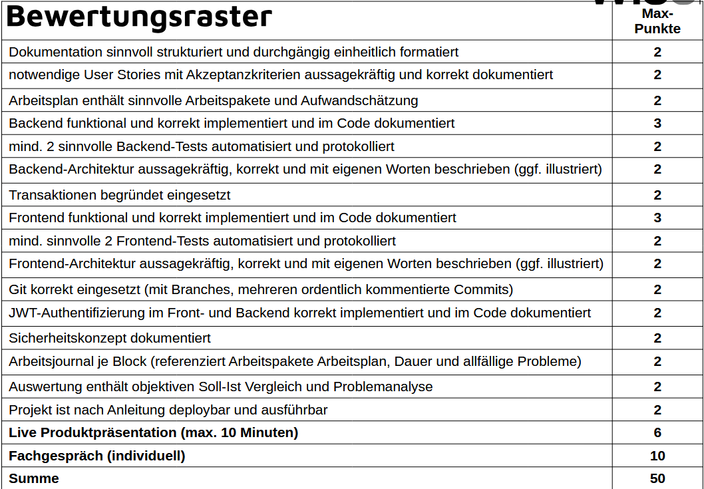
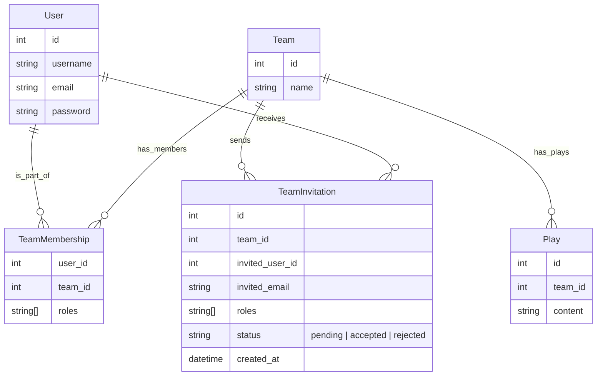
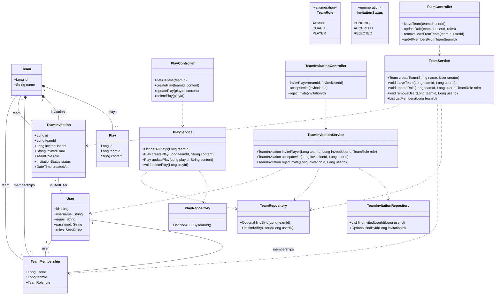

# football-website

# Informieren
## Projektvision
Ziel dieses Projekts ist es, eine multiuser-fähige Web-App zu entwickeln React im Frontend, Java + MySQL im Backend. Passend zu meinen Interessen habe ich mich für einen Playbook-Manager entschieden, den mehrere Nutzer gleichzeitig verwenden können.

## Bewertungsraster
Folgendes Bewertungsraster wird angewendet


# Planen
## Arbeitsplan
| Arbeitspaket                           | Aufwand     | Status |
| -------------------------------------- | ----------- | ------ |
| Informieren                            | 2 std       |    fertig  |
| User Stories                           | 2 std       |     fertig   |
| Backend Plan                           | 6 std       |       fertig |
| Frontend Plan                          | 6 std       |       fertig |
| Vervollständigung User Impl backend    | 3 std       |       fertig |
| Team Impl backend                      | 4 std       |      nicht nötig |
| Play Impl backend                      | 4 std       |        fertig|
| Dashboard Impl Frontend                | 3 std       |       fertig |
| Login / logout erweiterung falls nötig | 3 std       |        fertig|
| plays impl frontend                    | 3 std       |        fertig|
| members impl frontend                  | 3 std       |        fertig|
| Testplan                        | 1 std       |      in progress |
| Frontend Tests                       | 3 std       |      noch nicht begonnen |
| Backend Tests                        | 3 std       |      noch nicht begonnen |
| Test protokoll                      |  1 std      |      noch nicht begonnen |
| Website Deploybar machen                        | 3 std       |      noch nicht begonnen |
| Finishing touches für abgabe                    | 3 std       |      noch nicht begonnen |
| Optionale erweiterungen      | Undefiniert |      noch nicht begonnen |
## User Story 1 Registration
**Als** Benutzer  
**möchte ich** mich registrieren und Rollen wie Coach oder Spieler annehmen können  
**damit** ich Teams erstellen oder ihnen beitreten kann, abhängig von meiner Rolle in jedem Team.

### Akzeptanzkriterien
- Der Benutzer kann sich registrieren, **ohne** eine Rolle auszuwählen.
- Nach der Registrierung kann der Benutzer ein Team erstellen und wird automatisch **Admin** dieses Teams.
- Der Benutzer kann nach der Registrierung **einem bestehenden Team beitreten**, entweder als Coach oder als Spieler.
- Ein Benutzer kann in **mehreren Teams mit unterschiedlichen Rollen** gleichzeitig aktiv sein.

## User Story 2 Login/Logout
**Als** Benutzer  
**möchte ich** mich an- und abmelden können  
**damit** ich auf verschiedenen Geräten auf meine Teams zugreifen oder den Zugriff gezielt beenden kann.

### Akzeptanzkriterien 
- Der Benutzer kann sich mit **Benutzernamen und Passwort** anmelden.
- Der Benutzer bleibt angemeldet, bis er sich **explizit abmeldet**.
- Der Benutzer kann sich **jederzeit abmelden**.
- Nach dem Abmelden hat der Benutzer **keinen Zugriff** mehr auf seine Teams, bis er sich erneut anmeldet.

## User Story 3 Rollen verwaltung in Teams
**Als** Admin eines Teams  
**möchte ich** beigetretenen Benutzern die Rollen Spieler oder Coach und Admin zuweisen können  
**damit** sie die für ihre Rolle vorgesehenen Berechtigungen im Team erhalt

### Akzeptanzkriterien
- Der Admin sieht eine Liste von all den Benutzer in seinem Team
- Der Admin kann den Benutzern Rollen zuweisen
- Ein Benutzer kann **mehrere Rollen gleichzeitig in einem Team** haben. z. B. Spieler und Admin.

- Es muss **mindestens ein Admin pro Team** vorhanden sein.
## User Story 4 Plays Erstellen
**Als** Coach  
**möchte ich** Plays erstellen können  
**damit** meine Spieler eine **Ansicht** auf die Spielzüge haben.

### Akzeptanzkriterien
- Der Coach kann **Plays mit Name** erstellen.
- Spieler sehen **nur die Plays**, die im Kontext **ihres eigenen Teams** erstellt wurden.
- Die **Play-Ansicht für Spieler ist read-only** – sie können Inhalte **nicht bearbeiten**

## User Story 5 Plays Bearbeiten und Löschen
**Als** Coach  
**möchte ich** Plays bearbeiten und löschen können  
**damit** ich mein Playbook aktuell halten und veraltete Inhalte entfernen kann


### Aktzeptanzkriterien
- Der Coach kann **Plays bearbeiten**.
- Der Coach kann **Plays löschen** – inkl. Bestätigungsdialog (z. B. „Willst du das wirklich löschen?“).
- **Nur Coaches und Admins** des jeweiligen Teams können Inhalte bearbeiten oder löschen.
- **Spieler haben keinen Zugriff auf Bearbeiten oder Löschen.**

## User Story 6 Spieler in Teams einladen
**Als** Admin <br/>
**möchte ich** User in meinem Team einladen <br/>
**damit** ich Leute in meinem Team habe <br/>

### Aktzeptanzkriterien
- Der Admin kann **eine Einladung anhand der E-Mail oder Username senden**
- Eingeladene User müssen die Einladung **annehmen**, bevor sie im Team sind
- Der Admin kann beim Einladen **eine Rolle (z. B. Spieler, Coach)** festlegen
- User sehen ihre offenen Einladungen und können **annehmen oder ablehnen**
- **Nur Admins eines Teams** dürfen Leute einladen
- Ein User kann nur **einmal pro Team eingeladen werden**

## User Story 7 Teams verlassen
**Als** User <br/>
**möchte ich** Teams verlassen <br/>
**damit** ich mich von Teams trennen kann, die für mich nicht mehr relevant sind <br/>

### Aktzeptanzkriterien
- Jeder User kann **ein Team verlassen**, in dem er Mitglied ist
- Wenn der User der **einzige Admin** des Teams ist, muss vorher ein anderer Admin bestimmt werden (damit das Team nicht „adminlos“ wird)
- Beim Verlassen wird die entsprechende **TeamMembership gelöscht**
- Der User hat danach **keinen Zugriff mehr** auf Inhalte des Teams 
- Es gibt eine **Bestätigung** vorm Verlassen („Willst du wirklich Team X verlassen?“)

## User Story 8 Team-Mitglieder entfernen
**Als** Admin  <br/>
**möchte ich** Mitglieder aus meinem Team entfernen  <br/>
**damit** ich die Kontrolle darüber habe, wer Teil des Teams ist <br/>

### Aktzeptanzkriterien
- **Nur Admins** dürfen Mitglieder aus dem Team entfernen
- Ein Admin kann **alle Rollen eines Users** im Team entfernen, also z. B. auch Coaches
- Admins können **keine anderen Admins entfernen**, außer sie sind **mehrere Admins vorhanden**
- Wenn ein Admin einen anderen Admin kicken will, muss es mindestens **einen Admin danach noch geben**
- Der entfernte User verliert sofort: Zugriff auf alles vom Team
- Admin bekommt eine **Warnung/Bestätigung**, bevor ein Mitglied entfernt wird („Willst du Person X wirklich aus Team X entfernen?“)

User Stories wurden von ChatGPT nur minimal umgeschrieben und korrigiert

## Backend Plan

### ERD Diagramm


Das Mermaid diagramm wurde mit hilfe von ChatGPT erstellt jedoch geplant von mir

### Endpoint planung
#### Teams
|**Methode**|**Endpoint**|**Beschreibung**|
|---|---|---|
|`DELETE`|`/teams/:teamId/leave`|Team verlassen

#### Member-Verwaltung

| **Methode** | **Endpoint**                     | **Beschreibung**                         |
| ----------- | -------------------------------- | ---------------------------------------- |
| `PUT`       | `/teams/:teamId/members/:userId` | Rollen eines Users im Team aktualisieren |
| `DELETE`    | `/teams/:teamId/members/:userId` | User aus dem Team entfernen              |
| `GET`       | `/teams/:teamId/members/`        |                                          |

#### Einladungen
| **Methode** | **Endpoint**                 | **Beschreibung**         |
| ----------- | ---------------------------- | ------------------------ |
| `POST`      | `/teams/:teamId/invitations` | Einladung an User senden |
| `POST`      | `/invitations/:invId/accept` | Einladung annehmen       |
| `POST`      | `/invitations/:invId/reject` | Einladung ablehnen       |
#### Plays
| **Methode** | **Endpoint**           | **Beschreibung**                             |
| ----------- | ---------------------- | -------------------------------------------- |
| `POST`      | `/teams/:teamId/plays` | Neues Play erstellen (einfacher Text-String) |
| `GET`       | `teams/:teamId/plays`  | Alle Plays anzeigen                          |
| `PUT`       | `/plays/:playId`       | Play bearbeiten (Text ersetzen)              |
| `DELETE`    | `/plays/:playId`       | Play löschen                                 |
#### Auth
|**Methode**|**Endpoint**|**Beschreibung**|
|---|---|---|
|`POST`|`/api/auth/register`|Benutzer registrieren|
|`POST`|`/api/auth/login`|Benutzer einloggen|

#### Transaktionssichere Endpoints

| Endpoint                                | Warum?                              |
| --------------------------------------- | ----------------------------------- |
| `PUT /teams/:teamId/members/:userId`    | Admin-Rollen dürfen nicht wegfallen |
| `DELETE /teams/:teamId/members/:userId` | Letzten Admin schützen              |
| `DELETE /teams/:teamId/leave`           | Selbst verlassen, letzter Admin?    |
| `POST /invitations/:invId/accept`       | Membership + Einladung status       |


Die Ordnung und Formattierung ist von ChatGPT gemacht

### Klassendiagramm


Das Klassendiagramm wurde von ChatGPT korrigiert.

## Frontend-Plan 

### Tech-Stack

* **Framework**: React mit JavaScript

### UI-Guidelines
* **Design-Prinzipien**: Minimal, funktional first, Design later, ausreichend Weissraum, konsistente Farbpalette (z.B. Primary: #1E3A8A, Secondary: #FBBF24)

### Seiten & Komponenten

#### 1. Auth-Seiten

* **LoginPage**: Formular mit Username & Passwort, „Bestätigen“-Button, Link zur Registrierung
* **RegisterPage**: Formular mit Username, E-Mail, Passwort, Bestätigen-Button

#### 2. Team Dashboard 

* **TeamDashboardPage**: Übersicht des einen Teams mit folgenden Bereichen:

  * **Mitglieder**: Liste aller Mitglieder mit Rollen-Badges und Admin-Aktionen

  * **Plays**: Liste aller Plays mit Name und Aktion je nach Rolle

    **Component Breakdown**:

  * **MemberList**: Zeigt alle Mitglieder und ermöglicht Rollen-Updates

  * **PlayList**: Auflistung aller Plays mit Buttons zum Bearbeiten/Löschen (für Admin/Coach)

  * **PlayEditorModal**: Modal zum Erstellen oder Bearbeiten eines Plays

###  Routing-Plan

```txt
/login        → LoginPage
/register     → RegisterPage
/team         → TeamDashboardPage
/team/plays/ → ReadOnlyPlayView
/team/members/ → Team Member View Admin only
/nologin → nicht eingeloggte User sind hier
```


### Wireframe


## Testplan für das "football-website" Projekt

### Testgegenstand

* **Frontend**: React-Komponenten, Routen, UI-Elemente
* **Backend**: REST-APIs mit Spring Security & JWT 
* **Sicherheit**: Authentifizierung, Autorisierung, Token-Handling

### Testziele

* Funktionale Korrektheit aller User Stories
* Sicherheit der Auth-/Autho-Mechanismen

### Testmethoden und -arten

| Typ               | Beschreibung                                  | Tools                    |
| ----------------- | --------------------------------------------- | ------------------------ |
| Unit Tests        | Logik in Backend-Services & React-Komponenten | JUnit, Jest              |
| Integrationstests | API-Endpunkte + DB-Interaktionen              | Spring Test |
| Security-Tests    |  Role-Based Access                 | Insomnia                 |

### Testumgebung

* **Frontend**: Node.js, npm, Browser (Firefox)
* **Backend**: Java, Maven, H2/MySQL
* **Tools**: VS Code, Docker, CI/CD-Pipeline (GitHub Actions)

### Testumfang & Ausschluss

* **Im Scope**: Alle User Stories ausser Multi-Team Funktionalitäten (User Management, Plays, Dashboard, Login, Logout, KEINE User Invites, KEINE TEAM ROLLEN, NUR eine Rolle pro Member)

### Testfälle
| ID | Testfall                                                           | Schritte                                                                                                                                                                                                                                                                                                                                                                                                                                    | Erwartetes Ergebnis                                                                                                                               | Typ             |
| -- | ------------------------------------------------------------------ | ------------------------------------------------------------------------------------------------------------------------------------------------------------------------------------------------------------------------------------------------------------------------------------------------------------------------------------------------------------------------------------------------------------------------------------------- | ------------------------------------------------------------------------------------------------------------------------------------------------- | --------------- |
| 1  | Nutzer-Registrierung erfolgreich                                   | 1. Registrierung mit gültigen Daten  2. API-Aufruf                                                                                                                                                                                                                                                                                                                                                                                          | HTTP 201 + Token im Response-Body                                                                                                                 | Integration     |
| 2  | Login mit falschem Passwort                                        | 1. Login-Request mit falschem Passwort                                                                                                                                                                                                                                                                                                                                                                                                      | HTTP 401 + Fehlermeldung                                                                                                                          | Integration     |
| 3  | Zugriff auf geschützte Ressource ohne Token                        | GET /plays ohne Auth-Header                                                                                                                                                                                                                                                                                                                                                                                                                 | HTTP 401 Unauthorized                                                                                                                                | Security        |
| 4  | Playbook lädt Plays korrekt                                        | 1. Login  2. /plays                                                                                                                                                                                                                                                                                                                                                                                                                     | Play-Liste, UI aktualisiert                                                                                                              | End-to-End      |
| 5  | Fehlerhaftes Passwort bestätigt                                    | 1. /Register  2. Formular mit ungültigen Passwörtern einreichen                                                                                                                                                                                                                                                                                                                                                                             | Formular wird nicht abgeschickt                                                                                                                   | Integration     |
| 6  | Logout-Funktionalität                                              | 1. Login  2. /logout                                                                                                                                                                                                                                                                                                                                                                                                                        | Weiterleitung zu /nologin und JWT-Token nicht mehr im Storage                                                                                     | Integration     |
| 7  | Rollen-Assignment auf einzelne Rolle beschränkt                    | 1. POST /roles mit zwei Rollen im Request                                                                                                                                                                                                                                                                                                                                                                                                   | HTTP 400 + Fehlermeldung (Maximal eine Rolle pro Member)                                                                                          | Integration     
| 8  | ProtectedRoute Component leitet nicht-authentifizierte User weiter | Rendern von `<ProtectedRoute>` ohne `user` in AuthContext                                                                                                                                                                                                                                                                                                                                                                                   | Rendert `<Navigate to="/nologin" replace />`                                                                                                      | Unit (Frontend) |
| 9 | Home-Komponente zeigt Navigation und nutzt `navigate`              | 1. Mocke `useAuth()` so, dass `hasAnyRole(["ROLE_ADMIN"])` zuerst `false`, dann `true` zurückgibt<br>2. Mocke `useNavigate()` mit Jest-Spy<br>3. Render `<Home />` und prüfe, dass nur der Playbook-Button angezeigt wird<br>4. Re-render mit `hasAnyRole=true` und prüfe, dass zusätzlich der Mitglieder-Button erscheint<br>5. Klicke auf beide Buttons und verifiziere, dass `navigate` mit `"/plays"` bzw. `"/members"` aufgerufen wird | Home rendert Überschrift und Buttons korrekt, zeigt Mitglieder-Button nur für Admins, und ruft beim Klick `navigate` mit den richtigen Routen auf | Unit (Frontend) |
| 10 | `createPlay()` als Unit-Test mit gemocktem Repository              | 1. Mock: `playRepository.save(request)`  2. Aufruf von `playController.createPlay(request)`                                                                                                                                                                                                                                                                                                                                                 | `ResponseEntity` mit Status 201 und dem vom Mock zurückgegebenen Play                                                                             | Unit (Backend)  |
| 11 | `getAllPlays()` als Unit-Test mit gemocktem Repository             | 1. Mock: `playRepository.findAll()` → Liste von Plays  2. Aufruf von `playController.getAllPlays()`                                                                                                                                                                                                                                                                                                                                         | `ResponseEntity` mit Status 200 und dem Mock-Play-List-Array                                                                                      | Unit (Backend)  |

# Realisieren
## Arbeitsjournal
### 19.07.2025
**Arbeitspakete** Informieren und User Stories abgeschlossen Backend Planung angefangen. Userstories haben länger gebraucht als ich gedacht habe als 4 std waren es realistisch 6 std
### 26.06.2025
**Arbeitspakete** Backend Planung und Frontend Planung abgeschlossen. Die planung brauchte bei beiden nur 4 std und ich habe mich entschieden das Projekt kleiner zu machen und die Multi Team Funktionen rausnehmen durch die wenig verfügbare zeit. Der Arbeitsplan ist nun auch da!
### 27.06.2025
**Arbeitspakete** Vervollständigung User Impl backend. Hatte einige schwierigkeiten mit den AuthTokens aber war alles noch im Zeitramen realistisch genau soviel zeit gebraucht wie eingeplant :)
### 28.06.2025
**Arbeitspakete** Play Impl backend. Keine Schwierigkeiten hier. Hab eine Fehlplanung mit Teams gemacht, da wir eh nur ein Team haben brauchen wir auch nichts gespeichert im Backend. Plays war einfach zu implementieren und hat kürzer gedauert wie geplant, da es ja auch kein DTO oder weiteres braucht. Also heute viel Schmerz und leid gespart.
### 29.06.2025
**Arbeitspakete** Login / logout erweiterung falls nötig. Ich habe die login logout features vorgezogen, da dass Registrieren ja auch dazu gehört und allgemein einen Angenehmen workflow zu haben. Die weiterleitung und die NoLogin Page war ein bisschen nervig aber sonst keine probleme habe sehr viel weniger zeit gebraucht als 6 std habe ich Realistisch 2 gebraucht deswegen habe ich mich entschieden, für die weiteren Frontend elemente die Zeit zu kürzen.
### 30.06.2025
**Arbeitspakete** Dashboard Impl Frontend und plays impl frontend. Keine probleme hier. Habe auch noch das feature eingebaut mit einem hasRole tool um Permissionchecking einfacher zu machen. Sonst nichts spezielles beides hat zusammen etwa 4 std gebraucht was in rahmen war die 3 std Zeit ist nun sehr gut weil ich so noch eine stunde buffer habe.

### 01.07.2025
**Arbeitspakete** Members Impl Frontend. keine probleme mal wieder war alles im Zeitrahmen. Habe auch noch Authservice zu AuthContext refactored, damit man auto refreshes hat nach dem anmelden sonst funktionierte die gegenseitige weiterleitung von NoLogin und der normalen Homepage nicht. Jetzt kann man auch keine Rollen mehr schicken. Der Erste User ist jetzt Admin der Rest wird zu PLAYERN und der Admin mach den Rest auf der Homepage :). 

### 03.07.2025
**Arbeitspakete** Testplan, Frontend Tests und Backend tests. Hier hatte ich wenig probleme mit den Tests selbst. Jedoch war die aufsetzun von JEST sehr anstrengend. Sonst keine Probleme. Somit ist die Realisierung des Projekts fertig.

# Kontrollieren
## Testprotokoll
| TestID | Tester Vorname | Tester Nachname | Erwartetes Ergebnis                                                                                                                               | tatsächliches Ergebnis                                                                                                                            | Datum      | Test Bestanden |
| ------ | -------------- | --------------- | ------------------------------------------------------------------------------------------------------------------------------------------------- | ------------------------------------------------------------------------------------------------------------------------------------------------- | ---------- | -------------- |
| 1      | Max            | Hasselwander    | HTTP 201 + User in der Datenbank                                                                                                                  | Weiterleitung auf `/login` + User in der Datenbank                                                                                                | 04.07.2025 | ✔              |
| 2      | Max            | Hasselwander    | HTTP 401 + Fehlermeldung                                                                                                                          | HTTP 400 + Fehlermeldung                                                                                                                          | 04.07.2025 | ✔              |
| 3      | Max            | Hasselwander    | HTTP 401 Unauthorized                                                                                                                             | 401 Unauthorized                                                                                                                                  | 04.07.2025 | ✔              |
| 4      | Max            | Hasselwander    | Play-Liste, UI aktualisiert                                                                                                                       | Play-Liste, UI aktualisiert                                                                                                                       | 04.07.2025 | ✔              |
| 5      | Max            | Hasselwander    | Formular wird nicht abgeschickt                                                                                                                   | Formular wird nicht abgeschickt + Fehlermeldung                                                                                                   | 04.07.2025 | ✔              |
| 6      | Max            | Hasselwander    | Weiterleitung zu `/nologin` und JWT-Token nicht mehr im Storage                                                                                   | Weiterleitung zu `/nologin` und JWT-Token nicht mehr im Storage                                                                                   | 04.07.2025 | ✔              |
| 7      | Max            | Hasselwander    | HTTP 400 + Fehlermeldung (Maximal eine Rolle pro Member)                                                                                          | 401 Unauthorized / 400 Bad Request in Backend-Console                                                                                             | 04.07.2025 | ✔              |
| 8      | Max            | Hasselwander    | Home rendert Überschrift und Buttons korrekt, zeigt Mitglieder-Button nur für Admins, und ruft beim Klick `navigate` mit den richtigen Routen auf | Home rendert Überschrift und Buttons korrekt, zeigt Mitglieder-Button nur für Admins, und ruft beim Klick `navigate` mit den richtigen Routen auf | 04.07.2025 | ✔              |
| 9      | Max            | Hasselwander    | Rendern von `<ProtectedRoute>` ohne `user` in AuthContext                                                                                         | Rendern von `<ProtectedRoute>` ohne `user` in AuthContext                                                                                         | 04.07.2025 | ✔              |
| 10     | Max            | Hasselwander    | `ResponseEntity` mit Status 201 und dem vom Mock zurückgegebenen Play                                                                             | `ResponseEntity` mit Status 201 und dem vom Mock zurückgegebenen Play                                                                             | 04.07.2025 | ✔              |
| 11     | Max            | Hasselwander    | `ResponseEntity` mit Status 200 und dem Mock-Play-List-Array                                                                                      | `ResponseEntity` mit Status 200 und dem Mock-Play-List-Array                                                                                      | 04.07.2025 | ✔              |

# Auswerten
## Soll-Ist Vergleich
| Soll                                                       | Ist                                                            | Kommentar                                                                                                                                                                                                                                                                                                                     |
| ---------------------------------------------------------- | -------------------------------------------------------------- | ----------------------------------------------------------------------------------------------------------------------------------------------------------------------------------------------------------------------------------------------------------------------------------------------------------------------------- |
| Multi-Team                                                 | Single-Team                                                    | Nach weiterer Überlegung und Zeitdruck  bin ich auf Single User umgestiegen.<br>Es Ergibt auch mehr sinn für das Projekt an sich, da sich Multi-Team erst dann lohnt wenn man auch<br>Soziale Interaktionen zwischen Teams hat oder ein Spieler in Mehreren Teams ist. So het Theoretisch jedes Team seinen eigenen<br>Server |
| Beim löschen von Plays Bestätigungs Dialog                 | Kein Bestätigungs Dialog                                       | Da der Play nur ein String ist kann man ihn einfach wieder erstellen.<br>Wäre etwas für zukünftigere verfeinerungen                                                                                                                                                                                                           |
| Einladungen                                                | Keine Einladungen                                              | Ohne Multi User sehe ich keine begründung dazu aber ergibt auch<br>in einer Single-Team Welt sinn weil man ja nicht will, dass jeder die Plays sieht.                                                                                                                                                                         |
| Teams verlassen und Mitglieder entfernen                   | Teams kann man nicht verlassen und Mitglieder nicht entfernbar | ist ohne Multi-Team nicht nötig                                                                                                                                                                                                                                                                                               |
| MemberList, PlayList, PlayEditorModal Frontend Komponenten | alles in Playbook.jsx oder Members.jsx.                        | Code war schon minimal. Für erweiterungen wäre es gut, diese zu<br>separieren                                                                                                                                                                                                                                                 |
| Play Service                                               | nicht vorhanden                                                | nicht nötig                                                                                                                                                                                                                                                                                                                   |


## Problemanalyse
| Problem                                                                               | Wie tritt es auf              | Lösungsvorschlag                                                                                    |
| ------------------------------------------------------------------------------------- | ----------------------------- | --------------------------------------------------------------------------------------------------- |
| JWT Expired und man wird nicht ausgeloggt                                             | JWT token expired nach zeit   | vor jeder backend request JWT Token checken                                                         |
| HTTP fehlermeldungen geben immer 401 Unauthorized raus                                | schlechte Request auf backend | Message Response Anpassen vielleicht etwas in der Security Config                                   |
| Logout wird angezeigt wenn nicht eingeloggt und login registirierung wenn eingelogged | /                             | Protected Routes nur rendern wenn eingeloggt und nicht login registrieren nur wenn nicht eingeloggt |

## Ideen für Zukünftige Features
- Multi Team Funktion
- Besseres Errorhandling
- User Profiles
- Playdetails
- in App Play Editor 
- UI Verbesserungen

## Fazit
Ich musste zwar viele meiner ursprünglichen Ideen streichen und zur Vereinfachung auf ein Single-Team-Setup umsteigen, aber die App läuft und das war meine Top-Priorität. Das Error-Handling ist allerdings noch schwach und bleibt ein großer Verbesserungs­punkt für zukünftige Projekte. Ausserdem fällt es mir leichter, ein Projekt von Grund auf neu zu programmieren, als es auf einer bestehenden Basis aufzubauen. Trotzdem bin ich insgesamt zufrieden mit der App.