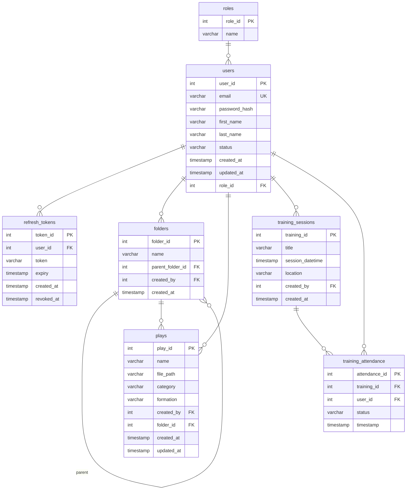

# football-website

## User Story 1 Registration
**Als** Benutzer  
**möchte ich** mich registrieren und Rollen wie Coach oder Spieler annehmen können  
**damit** ich Teams erstellen oder ihnen beitreten kann, abhängig von meiner Rolle in jedem Team.
### Akzeptanzkriterien
- Der Benutzer kann sich registrieren, **ohne** eine Rolle auszuwählen.
- Nach der Registrierung kann der Benutzer ein Team erstellen und wird automatisch **Admin** dieses Teams.
- Der Benutzer kann nach der Registrierung **einem bestehenden Team beitreten**, entweder als Coach oder als Spieler.
- Ein Benutzer kann in **mehreren Teams mit unterschiedlichen Rollen** gleichzeitig aktiv sein.
## User Story 2 Login/Logout
**Als** Benutzer  
**möchte ich** mich an- und abmelden können  
**damit** ich auf verschiedenen Geräten auf meine Teams zugreifen oder den Zugriff gezielt beenden kann.

### Akzeptanzkriterien 
- Der Benutzer kann sich mit **Benutzernamen und Passwort** anmelden.
- Der Benutzer bleibt angemeldet, bis er sich **explizit abmeldet**.
- Der Benutzer kann sich **jederzeit abmelden**.
- Nach dem Abmelden hat der Benutzer **keinen Zugriff** mehr auf seine Teams, bis er sich erneut anmeldet.
## User Story 3 Rollen verwaltung in Teams
**Als** Admin eines Teams  
**möchte ich** beigetretenen Benutzern die Rollen Spieler oder Coach und Admin zuweisen können  
**damit** sie die für ihre Rolle vorgesehenen Berechtigungen im Team erhalt

### Akzeptanzkriterien
- Der Admin sieht eine Liste von all den Benutzer in seinem Team
- Der Admin kann den Benutzern Rollen zuweisen
- Ein Benutzer kann **mehrere Rollen gleichzeitig in einem Team** haben. z. B. Spieler und Admin.
- Es muss **mindestens ein Admin pro Team** vorhanden sein.
## User Story 4 Playbook Erstellen
**Als** Coach  
**möchte ich** Plays und Ordner erstellen können  
**damit** meine Spieler eine **strukturierte und übersichtliche Ansicht** auf die Spielzüge haben.

### Akzeptanzkriterien
- Der Coach kann **Plays mit Name, Beschreibung und Bild** erstellen.
- Der Coach kann **Ordner mit Name** erstellen.
- Der Coach kann Plays **Ordnern zuweisen 
- Spieler sehen **nur die Plays**, die im Kontext **ihres eigenen Teams** erstellt wurden.
- Die **Play-Ansicht für Spieler ist read-only** – sie können Inhalte **nicht bearbeiten oder verschieben**.
- Die Ordnerstruktur ist **pro Team individuell und unabhängig** von anderen Teams.
## User Story 5 Playbook Bearbeiten und Löschen
**Als** Coach  
**möchte ich** Plays und Ordner bearbeiten und löschen können  
**damit** ich mein Playbook aktuell halten und veraltete Inhalte entfernen kann

### Aktzeptanzkriterien
- Der Coach kann **Plays und Ordner bearbeiten**, z. B. Name, Beschreibung, Bild (bei Plays).
- Der Coach kann **Plays und Ordner zwischen Ordnern verschieben**.
- Der Coach kann **Plays und Ordner löschen** – inkl. Bestätigungsdialog (z. B. „Willst du das wirklich löschen?“).
- **Nur Coaches und Admins** des jeweiligen Teams können Inhalte bearbeiten oder löschen.
- **Spieler haben keinen Zugriff auf Bearbeiten oder Löschen.**

User Stories wurden von ChatGpt nur minimal umgeschrieben und korrigiert

#ERD Diagramm

